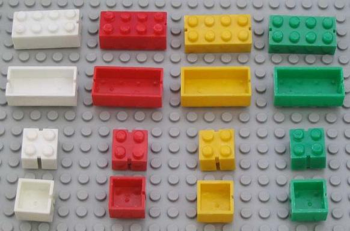

<br/>
<div style="text-align:center">

</div>

### Data

For this assignment you will be working with a synthetic data set of sales records for lego construction sets. We will assume that the original data was stored in a JSON format but a colleague has managed to import it into R as a list of lists data structure. The code below will load a copy of the object, called `sales`, into your R environment.

```{r eval=FALSE}
load("lego_sales.RData")
```

The original JSON file is also available, as `lego_sales.json` in your hw2 repo, if you would prefer to examine a text based representation of the data.

The data is structured such that each entry in the top list represents a different purchaser. These list entries contain basic information about the purchaser (name, age, phone number, etc.) as well as their purchase history. Everyone in the data set has purchased at least one lego set but most have purchased more than one. The purchase histories are stored in the `purchases` element which is also a list of lists. Each entry within the `purchases` list reflects a different lego set which the customer purchased. Note that the customer may have purchased more than one copy of any particular set, this number is stored as `Quantity` within the purchase record.

<br/>

### Task 1 - Tidying the data

Your first task is covert the `sales` object into a tidy data frame. Tidy in this case means each row should represents a separate purchase of a lego set by an individual and the columns should correspond to the keys in the JSON data. Duplicate columns should be avoided as much as possible and no data should be lost / ignored in the conversion.

Several guidelines / hints:

1. Be careful about making assumptions about the data - it is not as messy as real world data, but it is also not pristine and you are meant to run into several hiccups along the way.

1. Pay attention to types - the data frame you create should have columns that are of a type that matches the original data. 

1. Don't worry about duplicated data - since a customer can purchase multiple lego sets that customer's information may show up in multiple rows. This is fine and expected given the structure of the data. For the CS majors and minors: first normal form is ok in this case regardless of whatever your Databases professor may have told you.

1. Dealing with duplicate purchases - some customers purchased more than one copy of a particular lego set, for these individuals you can choose to code the purchase as multiple rows within the data frame or as a single row that also includes the quantity value. Either approach is fine, but your write up should discuss your choice. 

1. Avoid hard coding features of the data into your solutions (e.g. column names for your data frame should be determined at runtime). 

1. Do not output the entire data frame - use `str` or a similar function to show the structure of your results.

1. You may only use base R packages (i.e. your code cannot not use library or require at any point) to complete this task.

<br/>


## Task 2 - Processing the data

This task will involve answering a number of questions about that data that will involve manipulating and summarizing the data frame you created in Task 1. You are also welcome to use the original `sales` object if you believe that approach is more efficient for any particular question.

Only a one or two sentance write up is needed for these questions so long as you also include reasonably well documented code. For this task you are not allowed to use any non-base R packages other than dplyr and its dependencies. Make sure that your code outputs your answer and only your answer. 

<br/>

1. What was the most common first name of purchasers? Last name?

1. What are the five most popular lego sets based on these data?

1. Which five customers have spent the most money so far and how much have they spent?

1. Which lego theme has made the most money for lego?

1. Do men or women buy more lego sets (per person) on average?

1. What are the five most popular hobbies of lego purchasers?

1. How many total pieces have been purchased from lego by these customers?

1. What state has spent the most money on legos? Hint - customer area codes may prove useful for this.


<br/>

## Submission and Grading

This homework is due by *11 pm Monday, September 26th*. You are to complete the assignment as a group and to keep everything (code, write ups, etc.) on your team's github repository (commit early and often). All team members are expected to contribute equally to the completion of this assignment and group assessments will be given at its completion - anyone judged to not have sufficient contributed to the final product will have their grade penalized. While different teams members may have different coding backgrounds and abilities, it is the responsibility of every team member to understand how and why all code in the assignment works.

The final product for this assignment should be a single Rmd document (a template of which is provided) that contains all code and text for the tasks described above. This document should be clearly and cleanly formated and present all of your results. Style and formating does count for this assignment, so please take the time to make sure everything looks good and your text and code are properly formated. This document must be reproducible and I must be able to compile it with minimal intervention - documents that do not compile will be given a 0. 

We will be again using the Wercker continuous integration platform to test all of your code submissions. Everytime you push to github Wercker will attempt to compile your Rmd file and report back on its status. If Wercker is reporting that the build passes then your Rmd document can be cleanly compiled.

<br/>


