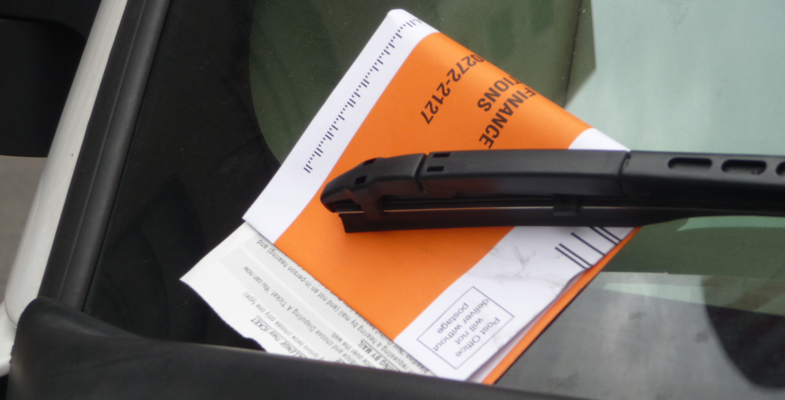

 

 

## Background

New York City is at the forefront of the open data movement among local, state and federal governments. They have made publicly available a huge amount of data ([NYC Open Data](https://nycopendata.socrata.com/)) on everything from street trees, to restaurant inspections, to parking violations. It is the last of these that we will be focusing on for this homework assignment. 

This will be our first foray in to big*ish* data as the CSV file containing these data is roughly 1.7 gigabytes in size and contains 9.1 million observations over 43 variables. This is not so big that we can't run our analyses on a moderately powerful laptop, but it is large enough that we need to start paying attention to what we are doing and the performance of our code. 

The data contains all parking violations from in the five boroughs of New York City from between August 2013 and June 2014. We will simplify matters somewhat by focusing our analyses solely on Manhattan (excluding Brooklyn, the Bronx, Queens, and Staten Island).

 

## Data

The violation data along with supplementary data is available on gort in `/data/nyc_parking/`. The available data are:

* `NYParkingViolations.csv` - all parking violations data available from between August 2013 and June 2014 ([source](https://data.cityofnewyork.us/City-Government/Parking-Violations-Issued/jt7v-77mi)).

* `pluto_manhattan` - directory containing a shapefile from [MapPLUTO](http://www.nyc.gov/html/dcp/html/bytes/dwn_pluto_mappluto.shtml#mappluto) which merges tax lot data with tax lot features (polygons). This shapefiles will be used for geocoding, as it connects property boundary polygons with addresses.

* `nybb` - directory containing NYC borough boundary shapefile.

* `altnames.csv` - some possibly useful information on alternative names for certain streets in NYC.

* `fine_definition.csv` - information on the type and amount of fine based on violation code.

 

## Task 1 - Geocoding

The parking violation data contains a large number of variables that we do not care about for the time being. For this first task your job is to attempt to geocode (find latitude and longitude for each entry) as much of the data as possible using the given variables. Note that this data has had minimal cleaning done, there are a large number of errors, omissions, and related issues. Also, note that there is a very large number of citations issued, 9.1 million over the course of the year, so even under the most optimistic of circumstances you will not be able to, nor should you, use any of the standard web based geocoding services.

In order to be successful at this task you do not need to geocode every address, or even most addresses. The goal is to geocode as many as possible with as much accuracy as possible to enable you to be successful with the 2nd task. This is a messy, large, and complex data set and at the best of times geocoding is a very difficult problem - go for the low hanging fruit first and then work on the edge cases / exceptions later as needed.

Your write up for this task should include a description of any and all cleaning / subsetting / etc. that was done to the data, as well as a description of your geocoding approach(es) and a discussion of how successful each was. 

 

## Task 2 - Recreating NYC's Police Precincts

The ultimate goal of this assignment is to attempt to reconstruct the boundaries of the 22 Manhattan New York City police precincts (numbered between 1 and 34). The parking violation data set contains the column, `Violation.Precinct`, that lists the police precinct in which the violation ostensibly took place. Your goal is to take this data along with the geocoded locations from Task 1 and generate a set of spatial polygons that represents the boundaries of the precincts.

As mentioned before, the data is complex and messy so keep in mind that there is no guarantee that the reported precinct is correct, or the street address, or even your geocoding. As such, the goal is not perfection, anything that even remotely resembles the precinct map will be considered a success. No single approach for this estimation is likely to work well, and an iterative approach to cleaning and tweaking will definitely be necessary. I would suggest initially focusing on a single precinct to develop your methods before generalizing to the entirety of Manhattan. 

To make things more interesting I will be offering a prize for the team that is best able to recreate the precinct map as judged by the smallest total area of discrepancy between your prediction and the true map. In order to win the prize you must abide by the rules as detailed below. I will maintain a leader board so that you will be able to judge how well you are doing relative to the other teams in the class.

For this task you are expected to produce a GeoJSON file called `precinct.json`, for details on formatting see the [hw_example repo](https://github.com/Sta523-Fa16/Team0_hw6). Your write up should include a discussion of your approaches to generating the boundaries and at least a simple visualization of your boundaries on top of the Manhattan borough boundary.

### Rules

* There will is a hard limit of 2 hours of run time for this assignment, I should be able to run make and have the entire analysis and all output finished within 2 hours on saxon.

* If you wish to use any additional data source(s), *you must* first check it with me and I will approve it or not. Additional data may only be used to improve the quality of your geocoding, you are not allowed to use anything beyond the geocoded parking violation data to directly estimate the precinct boundaries.

* You may not use any existing precinct data regardless of source. I am aware that the precinct boundaries are only a google search away - avoid the temptation. If I suspect that you have used this data at any point in your analysis your whole team will be disqualified from the performance contest and I also reserve the right to penalize your assignment grade for particularly egregious cases. This applies even to instances where you solely use the data to score yourself.

* Do not create unnecessary copies of the data, you *should not* create a local copy of `NYParkingViolations.csv` in your home directory on saxon. If you absolutely must, you can maintain a copy on your own laptop. If you are saving intermediary files, make sure to remove as much unnecessary data as possible (columns and or rows) and save the file in a binary format (e.g. .Rdata). Be aware of the size of your files and your disk usage and be very careful to not commit any large files to git as this can prevent you from being able to push to github.

 

## Submission and Grading

This homework is due by 11 pm Wednesday November 16th. You are to complete the assignment as a group and to keep everything (code, write ups, etc.) on your team's github repository (commit early and often). All team members are expected to contribute equally to the completion of this assignment and group assessments will be given at its completion - anyone judged to not have sufficient contributed to the final product will have their grade penalized. While different teams members may have different coding backgrounds and abilities, it is the responsibility of every team member to understand how and why all code in the assignment works.

The final product for this assignment include a single document named `hw6.Rmd` that contains a write up for your approach to both the geocoding of the violation addresses and the reconstruction of the police precinct boundaries. Your repository should also include commented R script(s) that implement both of these tasks as well as an appropriate Makefile which can be used to rerun the analyses, generate the `precinct.json` file, and compile `hw6.Rmd`.

 
