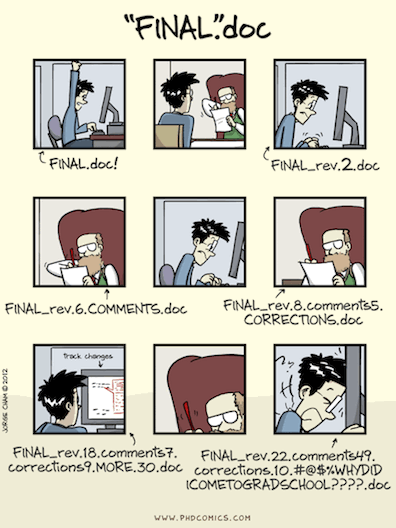
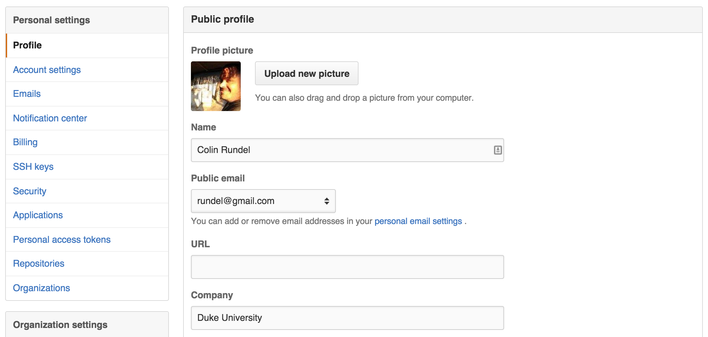
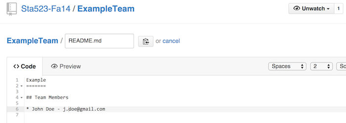
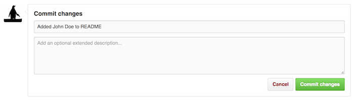
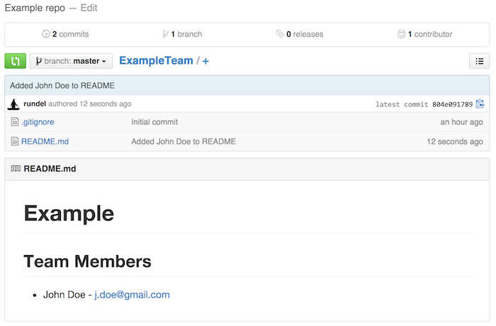
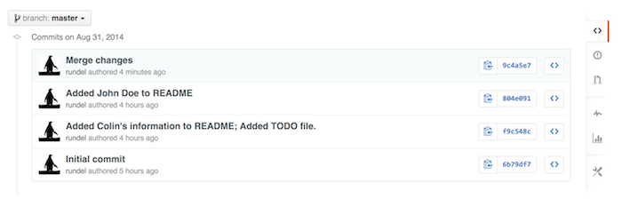

# Git Background

## Why version control? {.smaller}

<div class="centered" style="margin-top: -1em;">

</div>

## Why version control?

* Simple formal system for tracking all changes to a project

* Time machine for your projects
    * Track blame and/or praise
    * Remove the fear of breaking things

* Learning curve is steep, but when you need it you *REALLY* need it

<br/>
<br/>

<div class="centering">
<blockquote>
Your closest collaborator is you six months ago, but you don’t reply to emails.
</blockquote>
<cite>-- Paul Wilson, UW-Madison</cite>
</div>

## Why git?

* Distributed
    * Work online or offline
    * Collaborate with large groups

* Popular and Successful
    * Active development
    * Shiny new tools and ecosystems
    * Fast

* Tracks any type of file
    * Works best with text 

* Branching
    * Smarter merges

# Git Demo

## Some initial configuration {.smaller}

We want to let `git` know who we are so there are some simple configuration options we should setup.

Let's first tell `git` who we are, and what editor we want to use.

```bash
$ git config --global user.name "Colin Rundel"
$ git config --global user.email "rundel@gmail.com"
$ git config --global core.editor nano
```

We also want to set this up on saxon too, so

```bash
$ ssh cr173@saxon.stat.duke.edu
cr173@saxon [~]$ git config --global user.name "Colin Rundel"
cr173@saxon [~]$ git config --global user.email "rundel@gmail.com"
cr173@saxon [~]$ git config --global core.editor nano
```

## Some initial configuration

Make sure to put this information in your github profile as well.




## Working with github {.smaller}

For the time being


## Cloning a repository

```bash
cr173@saxon [Sta523]$ git clone https://github.com/Sta523-Fa16/git_example.git
Cloning into 'git_example'...
remote: Counting objects: 4, done.
remote: Compressing objects: 100% (3/3), done.
remote: Total 4 (delta 0), reused 0 (delta 0), pack-reused 0
Unpacking objects: 100% (4/4), done.
Checking connectivity... done.
```

```bash
cr173@saxon [Sta523]$ ls
git_example
cr173@saxon [Sta523]$ ls -a git_example/
.  ..  .git  README.md
```

## Checking the status

```bash
cr173@saxon [Sta523]$ cd git_example
cr173@saxon [git_example]$ git status
On branch master
Your branch is up-to-date with 'origin/master'.
nothing to commit, working directory clean
```

## Making changes

Lets edit the `README.md` file to include team member names and email addresses.

```bash
cr173@saxon [git_example]$ cat README.md
# git_example

Example repo
```

```bash
cr173@saxon [git_example]$ nano README.md
cr173@saxon [git_example]$ cat README.md
# git_example's Repo

## Team Members

* Colin Rundel - rundel@gmail.com
```

## Checking the status again

```bash
cr173@saxon [git_example]$ git status
On branch master
Your branch is up-to-date with 'origin/master'.
Changes not staged for commit:
  (use "git add <file>..." to update what will be committed)
  (use "git checkout -- <file>..." to discard changes in working directory)

    modified:   README.md

no changes added to commit (use "git add" and/or "git commit -a")
```

## Adding a new file {.smaller}

```bash
cr173@saxon [git_example]$ echo -e "* Add other team member's info\n* Fix formatting\n" > TODO
cr173@saxon [git_example]$ cat TODO
* Add other team member's info
* Fix formatting
```

## Checking the status yet again

```bash
cr173@saxon [git_example]$ git status
On branch master
Your branch is up-to-date with 'origin/master'.
Changes not staged for commit:
  (use "git add <file>..." to update what will be committed)
  (use "git checkout -- <file>..." to discard changes in working directory)

    modified:   README.md

Untracked files:
  (use "git add <file>..." to include in what will be committed)

    TODO

no changes added to commit (use "git add" and/or "git commit -a")
```

## Lets save our changes

* One file `README.md` is tracked and modified (repo is already has this file but our current version differs from the previously saved version)

* The other file `TODO` is untracked (this file does not exist in the repo)

Our next step is the same for both files - we want to *stage* our changes using `git add`.

```bash
cr173@saxon [git_example]$ git add README.md
cr173@saxon [git_example]$ git add TODO
```

##

```bash
cr173@saxon [git_example]$ git status
On branch master
Your branch is up-to-date with 'origin/master'.
Changes to be committed:
  (use "git reset HEAD <file>..." to unstage)

    modified:   README.md
    new file:   TODO

```

## What is staging?

By using `git add` we have made git aware of the current version of both files, but we have not actually saved the changes yet.

To save the changes (locally) we need to *commit* them using `git commit`, since this change will be saved it is customary to add a message about the nature of the changes being made (for future reference).

```bash
cr173@saxon [git_example]$ git commit -m "Added Colin's information to README; Added TODO file."
[master f9c548c] Added Colin's information to README; Added TODO file.
 2 files changed, 7 insertions(+), 2 deletions(-)
 create mode 100644 TODO
```

##

```bash
cr173@saxon [git_example]$ git status
On branch master
Your branch is ahead of 'origin/master' by 1 commit.
  (use "git push" to publish your local commits)
nothing to commit, working directory clean
```

We've saved our changes but we're now out of sync with the repository on github.

## Making the problem worse

What if at the same time I was making these edits my teammate John Doe was making changes to `README.md` on github?





##



## Syncing repos

We can attempt to send our changes back to github by using `git push`

```bash
cr173@saxon [git_example]$ git push
To git@github.com:Sta523-Fa16/git_example.git
 ! [rejected]        master -> master (fetch first)
error: failed to push some refs to 'git@github.com:Sta523-Fa16/git_example.git'
hint: Updates were rejected because the remote contains work that you do
hint: not have locally. This is usually caused by another repository pushing
hint: to the same ref. You may want to first integrate the remote changes
hint: (e.g., 'git pull ...') before pushing again.
hint: See the 'Note about fast-forwards' in 'git push --help' for details.
```

## Merging remote changes

```bash
cr173@saxon [git_example]$ git pull
remote: Counting objects: 3, done.
remote: Compressing objects: 100% (3/3), done.
remote: Total 3 (delta 0), reused 0 (delta 0)
Unpacking objects: 100% (3/3), done.
From github.com:Sta523-Fa16/git_example
   6b79df7..804e091  master     -> origin/master
Auto-merging README.md
CONFLICT (content): Merge conflict in README.md
Automatic merge failed; fix conflicts and then commit the result.
```

##

```bash
cr173@saxon [git_example]$ git status
On branch master
Your branch and 'origin/master' have diverged,
and have 1 and 1 different commit each, respectively.
  (use "git pull" to merge the remote branch into yours)
You have unmerged paths.
  (fix conflicts and run "git commit")

Unmerged paths:
  (use "git add <file>..." to mark resolution)

    both modified:   README.md

no changes added to commit (use "git add" and/or "git commit -a")
```

##

```bash
cr173@saxon [git_example]$ cat README.md 
git_example Repo
=======

## Team Members

<<<<<<< HEAD
* Colin Rundel - rundel@gmail.com
=======
* John Doe - j.doe@gmail.com
>>>>>>> 804e09178910383c128035ce67a58c9c1df3f558
```

* `<<<<<<<` - Indicates the start of the merge conflict.
* `=======` - Indicates the break point used for comparison. 
* `>>>>>>>` - Indicates the end of the lines that had a merge conflict.

## Resolving merge conflicts

Edit the merged file to reflect the changes you actually want.

```bash
cr173@saxon [git_example]$ nano README.md
cr173@saxon [git_example]$ cat README.md
git_example Repo
=======

## Team Members

* Colin Rundel - rundel@gmail.com
* John Doe - j.doe@gmail.com
```

## Stage and commit changes

```bash
cr173@saxon [git_example]$ git add README.md 
retBook-2:git_example rundel$ git status
On branch master
Your branch and 'origin/master' have diverged,
and have 1 and 1 different commit each, respectively.
  (use "git pull" to merge the remote branch into yours)
All conflicts fixed but you are still merging.
  (use "git commit" to conclude merge)

Changes to be committed:

    modified:   README.md

$ git commit -m "Fix Merge conflict"
```

##

```bash
cr173@saxon [git_example]$ git status
On branch master
Your branch is ahead of 'origin/master' by 2 commits.
  (use "git push" to publish your local commits)
nothing to commit, working directory clean
cr173@saxon [git_example]$ git push
Counting objects: 7, done.
Delta compression using up to 4 threads.
Compressing objects: 100% (6/6), done.
Writing objects: 100% (7/7), 791 bytes | 0 bytes/s, done.
Total 7 (delta 1), reused 0 (delta 0)
To git@github.com:Sta523-Fa16/git_example.git
   804e091..9c4a5e7  master -> master
```

##  {.smaller}

```bash
cr173@saxon [git_example]$ git log
commit 9c4a5e78866e00fccb78ddf170b62bc74812a7c7
Merge: f9c548c 804e091
Author: Colin Rundel <rundel@gmail.com>
Date:   Sun Aug 31 21:19:11 2014 -0400

    Merge changes

commit 804e09178910383c128035ce67a58c9c1df3f558
Author: Colin Rundel <rundel@gmail.com>
Date:   Sun Aug 31 17:43:47 2014 -0400

    Added John Doe to README

commit f9c548c0db0ee9b547a73ab44bacbba2a7facf04
Author: Colin Rundel <rundel@gmail.com>
Date:   Sun Aug 31 17:36:37 2014 -0400

    Added Colin's information to README; Added TODO file.

commit 6b79df75ce42e43ead368b0bb7e52246cf5ecc10
Author: Colin Rundel <rundel@gmail.com>
Date:   Sun Aug 31 16:18:27 2014 -0400

    Initial commit
```

##


##




# Acknowledgments

## Acknowledgments
Above materials are derived in part from the following sources:

* Karl Broman - [Wisc's Tools4RR](http://kbroman.org/Tools4RR/)
* [Software Carpentry Project](http://software-carpentry.org/)