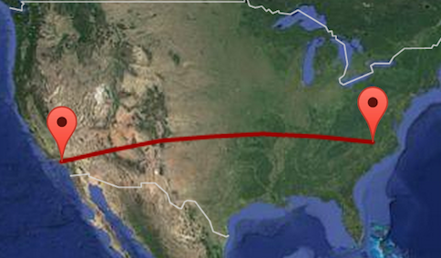

# Using R

## R on saxon

We will be using R via the RStudio server interface (web based), 

* Uniformity of software and dependencies

* Additional resources
    
    - 32 cores, 256 GB ram

    - shared data

<br/>

Connect via:
<center>
<a href="http://saxon.stat.duke.edu:8787">http://saxon.stat.duke.edu:8787</a>
</center>

# (Almost) Everything is a Vector

## Types of vectors

The fundamental building block of data / data structures in R are vectors (collections of related values, objects, data structures, etc).

<br/>
R has two fundamental vector classes:

* Vectors (atomic vectors) 

    - collections of values that are all of the *same* type (e.g. all logical values, all numbers, or all character strings).

* Lists (generic vectors)
  
    - collections of *any* type of R object, even other lists (meaning they can have a hierarchical/treelike structure).

More details on these next week.

# Conditionals

## Logical (boolean) operations

  Operator     Operation       Vectorized?
------------ --------------- -----------------
 `x | y`       or               Yes
 `x & y`       and              Yes
 `!x`          not              Yes
 `x || y`      or               No
 `x && y`      and              No
`xor(x,y)`     exclusive or     Yes


## Vectorized? {.build}

```{r}
x = c(TRUE,FALSE,TRUE)
y = c(FALSE,TRUE,TRUE)
```

<div class="columns-2">

```{r}
x | y
x || y
```

```{r}
x & y
x && y
```
</div>


## Vectorized? (Length coercion) {.build .smaller}

```{r include=FALSE}
w = options()$width
options(width=45)
```

```{r}
x = c(TRUE,FALSE,TRUE)
y = c(FALSE,TRUE)
z = c(TRUE)
```

<div class="columns-2">

```{r}
x | y
x | z
```

```{r}
x & y
x & z
```
</div>

```{r include=FALSE}
options(width=w)
```

## Comparisons

  Operator     Comparison                   Vectorized?
------------ ---------------------------- ------------------
 `x < y`       less than                    Yes
 `x > y`       greater than                 Yes
 `x <= y`      less than or equal to        Yes
 `x >= y`      greater than or equal to     Yes
 `x != y`      not equal to                 Yes
 `x == y`      equal to                     Yes
 `x %in% y`    contains                     Yes (for `x`)

 
## Comparisons {.build .smaller}

```{r}
x = c("A","B","C")
z = c("A")
```

<div class="columns-2">
```{r}
x == z
x != z
```

```{r}
x > z
```

```{r}
x %in% z
z %in% x
```

<br/><br/>
</div>


## Conditional Control Flow - if {.smaller}

Conditional execution of code blocks is achieved via `if` statements. Note that `if` statements are *not* vectorized.

```{r}
x = c(3,4)

if (3 %in% x)
    print("Here!")
if (x >= 2)
    print("Now Here!")
if (any(x >= 2))
    print("Now There!")
```

## Nesting Conditionals - `if`, `else if`, and `else`

<div class="columns-2">
```{r}
x = 3
if (x < 0) {
   print("Negative")
} else if (x > 0) {
   print("Positive")
} else {
   print("Zero")
}
```
```{r}
x = 0
if (x < 0) {
   print("Negative")
} else if (x > 0) {
   print("Positive")
} else {
   print("Zero")
}
```
</div>


# Loops

## `for` loops

Simplest, and most common type of loop in R - given a vector iterate through the elements and evaluate the code block for each.


```{r}
for(x in 1:10)
{
  cat(x^2," ", sep="")
}
```

```{r}
for(y in list(1:3, LETTERS[1:7], c(TRUE,FALSE)))
{
  cat(length(y)," ",sep="")
}
```

## Storing results {.smaller}

It is almost always better to create an object to store your results first, rather than growing the object as you go.

```{r}
# Good
res = rep(NA,10)
for(x in 1:10)
{
  res[x] = x^2
}
res

# Bad
res = c()
for (x in 1:10)
{
  res = c(res,x^2)
}
res
```

## Alternative loops - `while`

Repeat until the given condition is not met (i.e. results in `FALSE`)

```{r}
i = 1
res = rep(NA,10)
while (i <= 10)
{
  res[i] = i^2
  i = i+1
}
res
```


## Alternative loops - `repeat`

Repeat until `break`

```{r}
i = 1
res = rep(NA,10)
repeat
{
  res[i] = i^2
  i = i+1
  if (i > 10)
    break
}
res
```

## Special keywords - `break` and `next`

These are special actions that only work *inside* of a loop

* `break` - ends the current (inner-most) *loop*
* `next` - ends the current *iteration*

<div class="columns-2">
```{r}
for(i in 1:10)
{
    if (i %% 2 == 0)
        break
    cat(i,"")
}
```

```{r}
for(i in 1:10)
{
    if (i %% 2 == 0)
        next
    cat(i,"")
}
```
</div>

## Back to `for` loops {.smaller}

Often we want to use a loop across the indexes of an object and not the elements themselves. There are several useful functions to help you do this: `:`, `seq`, `seq_along`, `seq_len`, etc.

<div class="columns-2">

```{r}
l = list(1:3, LETTERS[1:7], c(TRUE,FALSE))
res = rep(NA, length(l))

for(x in seq_along(l))
{
  res[x] = length(l[[x]])
}

res
```
<br/><br/><br/>


```{r}
1:length(l)
seq_along(l)
seq_len(length(l))
```

</div>


## Looping over element indices {.build .smaller}

<div class="columns-2">
Best Practice:

```{r}
good = function(x)
{
  for(i in seq_along(x))
    cat(1,"")
}
```

Antipattern:
```{r}
bad = function(x)
{
  for(i in 1:length(x))
    cat(1,"")
}
```
</div>


<div class="columns-2">

```{r}
good(c(1,2,3))
good(c())
```
<br/><br/>


```{r}
bad(c(1,2,3))
bad(c())
```

</div>


## Some lessons learned {.smaller}

* Everything we've shown so far can also be done using
    * subsetting (`[]`) or
    * functional approaches (`*apply`)

<br/>

* There are almost always multiple possible approaches,
    * the best initial solution is the one you can get working the quickest
    * once something is working you can worry about making it faster / more efficient.

<br/>

> *Programmers waste enormous amounts of time thinking about, or worrying about, the speed of noncritical parts of their programs, and these attempts at efficiency actually have a strong negative impact when debugging and maintenance are considered. We should forget about small efficiencies, say about 97% of the time: __premature optimization is the root of all evil__. Yet we should not pass up our opportunities in that critical 3%.*

## Exercise 1

Below is the list of primes between 2 and 100:
```
2, 3, 5, 7, 11, 13, 17, 19, 23, 29, 31, 37, 41, 
43, 47, 53, 59, 61, 67, 71, 73, 79, 83, 89, 97
```

If you were given the vector `x = c(3, 4, 12, 19, 23, 48, 50, 61, 63, 78)`, write out the R code necessary to print only the values of `x` that are *not* prime (without using subsetting or the `%in%` operator). 

Your code should use nested loops to iterate through the vector of primes and `x`.


# Functions

## Function Basics

In R functions are objects, this means we can work with them like any other object in R.

```{r}
f = function(x) x*x
list(f)
typeof(f)
```

##

Similarly, functions can return other functions (functor)

```{r}
f2 = function(x) function(y) x+y
f2(1)
f2(1)(1)
```

## Function Parts

The two parts of a function are the arguments (`formals`) and the code (`body`).

```{r}
gcd = function(loc1, loc2)
{
  deg2rad = function(deg) return(deg*pi/180)

  lat1 = deg2rad( loc1[1] )
  lat2 = deg2rad( loc2[1] )
  long1 = deg2rad( loc1[2] )
  long2 = deg2rad( loc2[2] )

  R = 6371 # Earth mean radius in km
  d = acos(sin(lat1)*sin(lat2) + cos(lat1)*cos(lat2) * cos(long2-long1)) * R

  return(d) # distance in km
}
```

## {.smaller}

```{r}
formals(gcd)
body(gcd)
```

##

```{r}
los_angeles = c(34.052235, -118.243683)
durham = c(36.002453, -78.905869)

gcd(los_angeles, durham)
```

<div class="centered" style="margin-top: 1em;">

</div>

## Return values

In the preceding slides we have seen two approaches for returning values: explicit and implicit return values. Stylistically, we will prefer the former.

*Explicit* - includes one or more `return` statements

```{r}
f = function(x)
      return(x*x)
```

<br/>

*Implicit* - value of the last statement is returned.

```{r}
f = function(x)
      x*x
```

## Returning multiple values

If we want a function to return more than one value we can group things using either vectors or lists.


```{r}
f = function(x) list(x, x^2, x^3)
```

<div class="columns-2">
```{r}
f(2)
f(2:3)
```
</div>

## Argument names {.smaller}

When defining a function we are also implicitly defining names for the arguments, when calling the function we can use these names to


```{r}
f = function(x,y,z) paste0("x=",x," y=",y," z=",z)
```

<div class="columns-2">
```{r,error=TRUE}
f(1,2,3)
f(z=1,x=2,y=3)
f(y=2,1,3)
```

```{r,error=TRUE}
f(y=2,1,x=3)
f(1,2,3,m=1)
```
<br/></br>
</div>

## Argument defaults

In R it is possible to give function arguments default values,

```{r}
f = function(x=1,y=1,z=1) paste0("x=",x," y=",y," z=",z)
```

```{r, error=TRUE}
f()
f(2)
f(z=3)
```


## Scoping {.smaller}

R has generous scoping rules, if it can't find a variable in the functions body's scope, it will look for it in the next higher scope, and so on.

```{r}
y = 1
f = function(x)
{
  x+y
}
f(3)
g = function(x)
{
  y=2
  x+y
}
g(3)
```

## {.smaller}

Additionally, variables defined within a scope only persist for the duration of that scope, and do not overwrite variables at a higher scopes.

```{r}
x = 1
y = 1
z = 1
f = function()
{
    y = 2
    g = function()
    {
      z = 3
      return(x + y + z)
    }
    return(g())
}
f()
c(x,y,z)
```

## Lazy evaluation

Arguments to R functions are lazily evaluated - meaning they are not evaluated until they are used 

```{r, error=TRUE}
f = function(x)
{
  cat("Hello world!\n")
  x
}

f(stop("error"))
```


## Everything is a function

```{r}
typeof(`+`)
x = 4:1
`+`(x,2)
`+`
```

## Getting Help {.smaller}

Prefixing any function name with a `?` will open the related help file for that function.

```{r, eval=FALSE}
?`+`
?sum
```

For functions not in the base package, you can generally see their implementation by entering the function name without parentheses (or using `body` function).

```{r}
lm
```

## When to use functions

The goal of a function should be to encapsulate a *small* *reusable* piece of code.

* Name should make it clear what the function does (think in terms of simple verbs).

* Functionality should be simple enough to be quickly understood.

* The smaller and more modular the code the easier it will be to reuse elsewhere.

* Better to change code in one location than code everywhere.


## Infix functions (operators)

We can define our own infix functions like `+` or `*`, the only requirement is that they must start and end with a `%`.

```{r}
`%nand%` = function(x, y) !(x & y)
```

<div class="columns-2">
```{r}
TRUE %nand% TRUE
TRUE %nand% FALSE
FALSE %nand% TRUE
FALSE %nand% FALSE
```
</div>


## Exercise 2

What would the output of the following code block be? Explain why.

```{r}
z = 1

f = function(x,y,z)
{
  z = x+y

  g = function(m=x,n=y)
  {
    m/z + n/z
  }

  z * g()
}

f(1,2,3)
```


# Acknowledgments
## Acknowledgments

Above materials are derived in part from the following sources:

* Hadley Wickham - [Advanced R](http://adv-r.had.co.nz/)
* [R Language Definition](http://stat.ethz.ch/R-manual/R-devel/doc/manual/R-lang.html)


