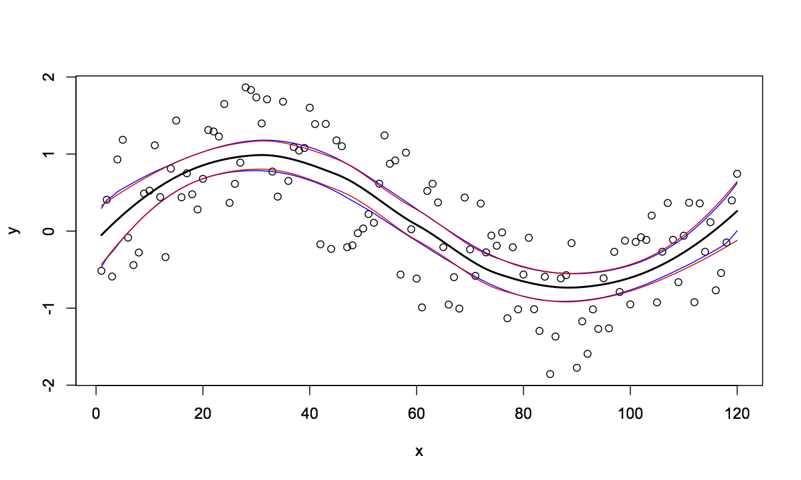

```{r echo=FALSE}
suppressMessages(library(parallel))
suppressMessages(library(doMC))
suppressMessages(library(foreach))
suppressMessages(library(dplyr))
suppressMessages(library(ggplot2))
```

# parallel

## parallel

Part of the base packages in R 

* tools for the forking of R processes (some functions do not work on Windows)

* Core functions:
    
    * `detectCores`

    * `pvec`

    * `mclapply`

    * `mcparallel` & `mccollect`


## detectCores

Surprisingly, detects the number of cores of the current system.

```{r eval=FALSE}
detectCores()

## [1] 24
```

## pvec

Parallelization of a vectorized function call

```{r eval=FALSE}
system.time(pvec(1:1e7, sqrt, mc.cores = 1))

##   user  system elapsed 
##  0.214   0.029   0.243 

system.time(pvec(1:1e7, sqrt, mc.cores = 4))

##   user  system elapsed 
##  0.442   0.185   0.631 

system.time(pvec(1:1e7, sqrt, mc.cores = 8))

##   user  system elapsed 
##  0.532   0.389   0.372 
```


##
```{r eval=FALSE}
cores = c(1,2,4,8,16,24)
order = 6:8
res = sapply(
  cores, 
  function(x) 
  {
    sapply(
      order, 
      function(y) system.time(pvec(1:(10^y), sqrt, mc.cores=x))[3] 
    )
  }
)
colnames(res) = paste0(cores," cores")
rownames(res) = paste0("10^",order)
res

##       1 cores 2 cores 4 cores 8 cores 16 cores 24 cores
##  10^6   0.013   0.057   0.044   0.048    0.062    0.075
##  10^7   0.109   0.419   0.321   0.310    0.346    0.389
##  10^8   1.248   3.790   3.084   3.683    3.626    3.658
```

## mclapply {.smaller}

Parallelized version of `lapply`

```{r eval=FALSE}
system.time(rnorm(1e6))

##   user  system elapsed 
##  0.101   0.007   0.107 

system.time(unlist(mclapply(1:10, function(x) rnorm(1e5), mc.cores = 2)))

##   user  system elapsed 
##  0.148   0.136   0.106 

system.time(unlist(mclapply(1:10, function(x) rnorm(1e5), mc.cores = 4)))

##   user  system elapsed 
##  0.242   0.061   0.052 ```
```

## {.smaller}

```{r eval=FALSE}
system.time(unlist(mclapply(1:10, function(x) rnorm(1e5), mc.cores = 4)))

##   user  system elapsed 
##  0.097   0.047   0.079 

system.time(unlist(mclapply(1:10, function(x) rnorm(1e5), mc.cores = 8)))

##   user  system elapsed 
##  0.193   0.076   0.040 

system.time(unlist(mclapply(1:10, function(x) rnorm(1e5), mc.cores = 10)))

##   user  system elapsed 
##  0.162   0.083   0.041 

system.time(unlist(mclapply(1:10, function(x) rnorm(1e5), mc.cores = 12)))

##   user  system elapsed 
##  0.098   0.065   0.037 
```

## mcparallel {.smaller}

Asynchronously evaluation of an R expression in a separate process

```{r}
m = mcparallel(rnorm(1e6))
n = mcparallel(rbeta(1e6,1,1))
o = mcparallel(rgamma(1e6,1,1))

str(m)
str(n)
```

## mccollect

Checks `mcparallel` objects for completion

```{r}
str(mccollect(list(m,n,o)))
```

## mccollect - waiting {.smaller}

```{r}
p = mcparallel(mean(rnorm(1e5)))
mccollect(p, wait = FALSE, 10) # will retrieve the result (since it's fast)
mccollect(p, wait = FALSE)     # will signal the job as terminating
mccollect(p, wait = FALSE)     # there is no longer such a job
```

# doMC & foreach

## doMC & foreach

Packages by Revolution Analytics that provides the `foreach` function which is a parallelizable `for` loop (and then some).

* Core functions:
    
    * `registerDoMC`

    * `foreach`, `%dopar%`, `%do%`

## registerDoMC {.smaller}

Primarily used to set the number of cores used by `foreach`, by default uses `options("cores")` or half the number of cores found by `detectCores` from the parallel package.

```{r eval=FALSE}
options("cores")

## $cores
## NULL

detectCores()

## [1] 24

getDoParWorkers()

## [1] 1

registerDoMC(4)
getDoParWorkers()

## [1] 4
```

## foreach {.smaller}

A slightly more powerful version of base `for` loops (think `for` with an `lapply` flavor). Combined with `%do%` or `%dopar%` for single or multicore execution.

```{r}
for(i in 1:10) sqrt(i)

foreach(i = 1:5) %do% sqrt(i)   
```

## foreach - iterators {.smaller}

`foreach` can iterate across more than one value

<div class="columns-2">
```{r}
foreach(i = 1:5, j = 1:5) %do% sqrt(i^2+j^2)   
```
```{r}
foreach(i = 1:5, j = 1:2) %do% sqrt(i^2+j^2)   
```
<br/><br/><br/><br/><br/><br/>
</div>


## foreach - combining results {.smaller}

```{r}
foreach(i = 1:5, .combine='c') %do% sqrt(i)   
foreach(i = 1:5, .combine='cbind') %do% sqrt(i)   
foreach(i = 1:5, .combine='+') %do% sqrt(i)   
```


## foreach - parallelization {.smaller}

Swapping out `%do%` for `%dopar%` will use the parallel backend.

```{r}
registerDoMC(4)
system.time(foreach(i = 1:10) %dopar% mean(rnorm(1e6)))
registerDoMC(8)
system.time(foreach(i = 1:10) %dopar% mean(rnorm(1e6)))
registerDoMC(12)
system.time(foreach(i = 1:10) %dopar% mean(rnorm(1e6)))
```


## Exercise 1 - Bootstraping {.smaller}

Bootstrapping is a resampling scheme where the original data is repeatedly reconstructed by taking a sample (with replacement) of the same size of the original data, and using that to conduct whatever analysis procedure is of interest. Below is an example of fitting a local regression (`loess`) to some synthetic data, we will construct a bootstrap prediction interval for this model.


```{r eval=FALSE}
set.seed(3212016)
d = data.frame(x = 1:120) %>%
    mutate(y = sin(2*pi*x/120) + runif(length(x),-1,1))

l = loess(y ~ x, data=d)
d$pred_y = predict(l)
d$pred_y_se = predict(l,se=TRUE)$se.fit

ggplot(d, aes(x,y)) +
  geom_point() +
  geom_line(aes(y=pred_y)) +
  geom_line(aes(y=pred_y + 1.96 * pred_y_se), color="red") +
  geom_line(aes(y=pred_y - 1.96 * pred_y_se), color="red")
```

##

```{r echo=FALSE, fig.align="center", fig.width=9, fig.height=6}
set.seed(3212016)
d = data.frame(x = 1:120) %>%
    mutate(y = sin(2*pi*x/120) + runif(length(x),-1,1))

l = loess(y ~ x, data=d)
d$pred_y = predict(l)
d$pred_y_se = predict(l,se=TRUE)$se.fit

ggplot(d, aes(x,y)) +
  geom_point() +
  geom_line(aes(y=pred_y)) +
  geom_line(aes(y=pred_y + 1.96 * pred_y_se), color="red") +
  geom_line(aes(y=pred_y - 1.96 * pred_y_se), color="red")
```

## Exercise 1 - Cont. {.smaller}

Re-implement the code below using one of the parallelization techniques we have just discussed, check your performance in creating the bootstrap sample using for 1, 2, and 4 cores. (Work with a neighbor so you are not all running MC code at the same time)


```{r eval=FALSE}
n_rep = 10000
res = matrix(NA, ncol=n_rep, nrow=nrow(d))

for(i in 1:ncol(res))
{ 
  bootstrap_samp = d %>% select(x,y) %>% sample_n(nrow(d), replace=TRUE)
  res[,i] = predict(loess(y ~ x, data=bootstrap_samp), newdata=d)
}

# Calculate the 95% bootstrap prediction interval
d$bs_low = apply(res,1,quantile,probs=c(0.025), na.rm=TRUE)
d$bs_up  = apply(res,1,quantile,probs=c(0.975), na.rm=TRUE)

ggplot(d, aes(x,y)) +
  geom_point() +
  geom_line(aes(y=pred_y)) +
  geom_line(aes(y=pred_y + 1.96 * pred_y_se), color="red") +
  geom_line(aes(y=pred_y - 1.96 * pred_y_se), color="red") +
  geom_line(aes(y=bs_low), color="blue") +
  geom_line(aes(y=bs_up), color="blue")
```


## 

<div class="centered">

</div>


## What to use when?

Optimal use of multiple cores is hard, there isn't one best solution

* Don't underestimate the overhead cost

* More art than science - experimentation is key

* Measure it or it didn't happen

* Be aware of the trade off between developer time and run time


# BLAS and LAPACK

## Statistics and Linear Algebra

An awful lot of statistics is at its core linear algebra.

<br/>

For example:

* Linear regession models, find

$$ \hat{\beta} = (X^T X)^{-1} X^Ty $$

* Principle component analysis

    * Find $T = XW$ where $W$ is a matrix whose columns are the eigenvectors of $X^TX$.
    
    * Often solved via SVD - Let $X = U\Sigma W^T$ then $T = U\Sigma$.


## Numerical Linear Algebra

Not unique to Statistics, these are the type of problems that come up across all areas of numerical computing.

* Numerical linear algebra $\ne$ mathematical linear algebra

<br/>

* Efficiency and stability of numerical algorithms matter

    * Designing and implementing these algorithms is hard

<br/>

* Don't reinvent the wheel - common core linear algebra tools (well defined API)


## BLAS and LAPACK {.smaller}

Low level algorithms for common linear algebra operations

<br/>

BLAS

* **B**asic **L**inear **A**lgebra **S**ubprograms

* Copying, scaling, multiplying vectors and matrices

* Origins go back to 1979, written in Fortran

<br/>

LAPACK

* **L**inear **A**lgebra **Pack**age

* Higher level functionality building on BLAS.

* Linear solvers, eigenvalues, and matrix decompositions

* Origins go back to 1992, mostly Fortran (expanded on LINPACK, EISPACK)


## Modern variants?

Most default BLAS and LAPACK implementations (like R's defaults) are somewhat dated

* Designed for a single cpu core  

* Certain (potentially non-optimal) hard coded defaults (e.g. block size).

<br/>

Multithreaded alternatives:

* ATLAS - Automatically Tuned Linear Algebra Software

* OpenBLAS - fork of GotoBLAS from TACC at UTexas

* Intel MKL - Math Kernel Library, part of Intel's commercial compiler tools

* cuBLAS / Magma - hybrid CPU / GPU library from UTK


## Naming conventions

BLAS and LAPACK subroutines are named using form `pmmaaa` where:

* `p` is a one letter code for the type of data

    * `S` single precision floating point
    * `D` double precision floating point
    * `C` complex single precision floating point
    * `Z` complex double precision floating point

* `mm` is a two letter code for the type of matrix expected by the subroutine

* `aaa` is a one to three letter code denoting the algorithm implemented by subroutine


## BLAS Example - DGEMM{.smaller}

`D` - type double, `GE` - general matrix, `MM` - matrix / matrix multiplication.

```
dgemm(   character   TRANSA,
         character   TRANSB,
         integer     M,
         integer     N,
         integer     K,
         double precision    ALPHA,
         double precision, dimension(lda,*)  A,
         integer     LDA,
         double precision, dimension(ldb,*)  B,
         integer     LDB,
         double precision    BETA,
         double precision, dimension(ldc,*)  C,
         integer     LDC 
     )   
```

`DGEMM` performs one of the matrix-matrix operations

$$C = \alpha op( A ) \times op( B ) + \beta C$$

where $op( X )$ is either $op( X ) = X$ or $op( X ) = X^T$, $\alpha$ and $\beta$ are scalars, and $A$, $B$ and $C$ are matrices, with $op( A )$
an $m$ by $k$ matrix, $op( B )$  a $k$ by $n$ matrix and $C$ an $m$ by $n$ matrix.


## LAPACK Example - `DPOTRF` {.smaller}

`D` - type double, `PO` - positive definite matrix, `TRF` - triangular factorization


```
dpotrf(  character   UPLO,
         integer     N,
         double precision, dimension( lda, * )   A,
         integer     LDA,
         integer     INFO 
      )   
```

`DPOTRF` computes the Cholesky factorization of a real symmetric positive definite matrix $A$.

The factorization has the form
$$A = U^T * U,  \text{if UPLO = 'U', or}$$
$$A = L  * L^T,  \text{if UPLO = 'L',}$$
where $U$ is an upper triangular matrix and $L$ is lower triangular.


## OpenBLAS DGEMM Performance {.smaller}

```{r, eval=FALSE}
library(RhpcBLASctl)
x=matrix(runif(5000^2),ncol=5000)

sizes = c(100,500,1000,2000,3000,4000,5000)
cores = c(1,2,4,8)

sapply(
  cores, 
  function(n_cores) 
  {
    blas_set_num_threads(n_cores)
    sapply(
      sizes, 
      function(s) 
      {
           y = x[1:s,1:s]
           system.time(y %*% y)[3]
      }
    )
  }
)
```

##

|  n   | 1 core | 2 cores | 4 cores | 8 cores |
|------|--------|---------|---------|---------|
| 100  |  0.001 | 0.001   | 0.000   | 0.000   |
| 500  |  0.018 | 0.011   | 0.008   | 0.008   |
| 1000 |  0.128 | 0.068   | 0.041   | 0.036   |
| 2000 |  0.930 | 0.491   | 0.276   | 0.162   |
| 3000 |  3.112 | 1.604   | 0.897   | 0.489   |
| 4000 |  7.330 | 3.732   | 1.973   | 1.188   |
| 5000 | 14.223 | 7.341   | 3.856   | 2.310   |

## GPU vs OpenBLAS {.smaller}

|  M   |   N   |   K    | MAGMA Gflop/s (ms) | cuBLAS Gflop/s (ms) | CPU Gflop/s (ms)  |
|------|-------|--------|--------------------|---------------------|-------------------|
| 1088 |  1088 |  1088  |  550.51 (   4.68)  |   430.65 (   5.98)  |  37.04 (  69.54)  |
| 2112 |  2112 |  2112  |  632.45 (  29.79)  |  1086.90 (  17.33)  |  57.20 ( 329.42)  |
| 3136 |  3136 |  3136  |  625.10 (  98.68)  |  1138.67 (  54.17)  |  64.33 ( 958.82)  |
| 4160 |  4160 |  4160  |  625.07 ( 230.35)  |  1146.94 ( 125.54)  |  67.93 (2119.71)  |
| 5184 |  5184 |  5184  |  621.02 ( 448.66)  |  1156.58 ( 240.91)  |  69.68 (3998.74)  |
| 6208 |  6208 |  6208  |  619.12 ( 772.88)  |  1159.71 ( 412.61)  |  70.35 (6801.51)  |
| 7232 |  7232 |  7232  |  617.88 (1224.33)  |  1162.48 ( 650.76)  |  71.17 (10629.33) |
| 8256 |  8256 |  8256  |  617.28 (1823.29)  |  1163.65 ( 967.20)  |  71.50 (15740.96) |
| 9280 |  9280 |  9280  |  617.09 (2590.17)  |  1166.20 (1370.57)  |  71.46 (22367.01) |
|10304 | 10304 | 10304  |  622.05 (3517.43)  |  1168.40 (1872.64)  |  71.51 (30597.85) |
