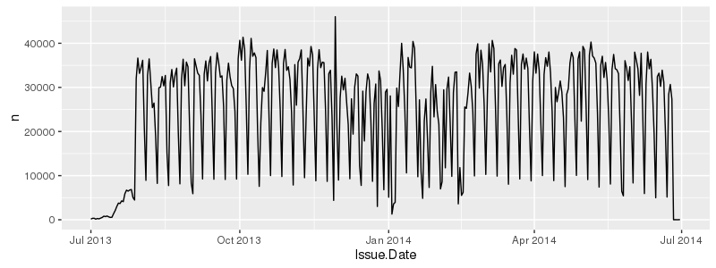

```{r, echo=FALSE}
options(width = 110)

suppressMessages(library(dplyr))
suppressMessages(library(magrittr))
```

# Background

## Big vs Bigish data

* We will be working with data that is large, but will still fit in memory. 

* R *loves* to make extra copies of objects, so we need to be careful - even a handful of copies with exhaust the memory on most systems. 
    
    * Less of an issue on saxon (256 GB of Ram), but this is a shared resource - use too much and your session will be killed.

* In general you should prefer:

<div class="centered">
<br/>
*subsetting/vectorization >> apply > loops*

<br/>
*built-in/base > user C/C++ functions > user R functions*
</div>

# Reading Data

## Reading parking data

If we use the basic approach of `read.csv`, we end up waiting a really long time,

```{r, eval=FALSE}
system.time(read.csv("/data/nyc_parking/NYParkingViolations.csv"))

##    user  system elapsed  
## 377.359   7.080 384.411 
```

Over 6 minutes to read in a 1.7 gigabyte CSV file.

## Improvements 

If we use `stringsAsFactors` and `comment.char` arguments we can speed things up a bit.

```{r, eval=FALSE}
system.time(read.csv("/data/nyc_parking/NYParkingViolations.csv", 
                     stringsAsFactors=FALSE, 
                     comment.char="")
           )

##    user  system elapsed 
## 281.399   4.615 285.975 
```

We can take this farther by specifying the structure of the data using the `colClasses` argument.

## Alternatives - data.table

```{r, eval=FALSE}
library(data.table)
system.time({nyc = fread("/data/nyc_parking/NYParkingViolations.csv")})

## Read 9100278 rows and 43 (of 43) columns from 1.673 GB file in 00:00:52
##    user  system elapsed 
##  50.855   0.970  51.793 

class(nyc)

## "data.table" "data.frame"

nyc = as.data.frame(nyc)
class(nyc)

## [1] "data.frame"
```

## Alternatives - readr {.smaller}

```{r, eval=FALSE}
library(readr)
system.time({nyc = read_csv("/data/nyc_parking/NYParkingViolations.csv")})

## Parsed with column specification:
## cols(
##   .default = col_character(),
##   `Summons Number` = col_double(),
##   `Violation Code` = col_integer(),
##   `Street Code1` = col_integer(),
##   `Street Code2` = col_integer(),
##   `Street Code3` = col_integer(),
##   `Vehicle Expiration Date` = col_integer(),
##   `Violation Precinct` = col_integer(),
##   `Issuer Precinct` = col_integer(),
##   `Issuer Code` = col_integer(),
##   `Date First Observed` = col_integer(),
##   `Law Section` = col_integer(),
##   `Violation Legal Code` = col_integer(),
##   `Unregistered Vehicle?` = col_integer(),
##   `Vehicle Year` = col_integer(),
##   `Feet From Curb` = col_integer()
## )
## See spec(...) for full column specifications.
## |================================================================================| 100% 1713 MB
``` 

## {.smaller}

```{r, eval=FALSE}
## Warning: 654437 parsing failures.
##  row                  col   expected actual
## 2647 Violation Legal Code an integer      T
## 3792 Violation Legal Code an integer      T
## 4001 Violation Legal Code an integer      T
## 4002 Violation Legal Code an integer      T
## 4003 Violation Legal Code an integer      T
## .... .................... .......... ......
## See problems(...) for more details.
## 
##    user  system elapsed 
## 103.196   6.792 108.993 
```

## readr {.smaller}

This is a recent package that is designed to be a fast and friendly way of reading tabular data into R.

<br/>

Core features:

* Faster than base R (~3-4x)

* No strings as factors

* No column name mangling

* Consistent argument/function naming scheme

* Plays nice with dplyr (`tbl_df`)

* Progress bars


## {.smaller}
```{r, eval=FALSE}
nyc

## Source: local data frame [9,100,278 x 43]
## 
##    Summons Number Plate ID Registration State Plate Type Issue Date Violation Code
##             (dbl)    (chr)              (chr)      (chr)      (chr)          (int)
## 1      1361929741  FCJ5493                 NY        PAS 12/18/1970             20
## 2      1366962000  63540MC                 NY        COM 02/02/1971             46
## 3      1356906515  GFM1421                 NY        PAS 09/18/1971             40
## 4      1342296217  FYM5117                 NY        SRF 09/18/1971             21
## 5      1342296199  95V6675                 TX        PAS 09/18/1971             21
## 6      1342296187  GCY4187                 NY        SRF 09/18/1971             21
## 7      1337077380  18972BB                 NY        999 10/10/1971             14
## 8      1364523796  WNJ4730                 VA        PAS 04/05/1973             14
## 9      1359914924  68091JZ                 NY        COM 07/22/1973             46
## 10     1355498326  EWV4127                 NY        PAS 08/12/1973             21
## ..            ...      ...                ...        ...        ...            ...
## Variables not shown: Vehicle Body Type (chr), Vehicle Make (chr), Issuing Agency (chr),
##   Street Code1 (int), Street Code2 (int), Street Code3 (int), Vehicle Expiration Date
##   (int), Violation Location (chr), Violation Precinct (int), Issuer Precinct (int),
##   Issuer Code (int), Issuer Command (chr), Issuer Squad (chr), Violation Time (chr), Time
##   First Observed (chr), Violation County (chr), Violation In Front Of Or Opposite (chr),
##   House Number (chr), Street Name (chr), Intersecting Street (chr), Date First Observed
##   (int), Law Section (int), Sub Division (chr), Violation Legal Code (int), Days Parking
##   In Effect (chr), From Hours In Effect (chr), To Hours In Effect (chr), Vehicle Color
##   (chr), Unregistered Vehicle? (int), Vehicle Year (int), Meter Number (chr), Feet From
##   Curb (int), Violation Post Code (chr), Violation Description (chr), No Standing or
##   Stopping Violation (chr), Hydrant Violation (chr), Double Parking Violation (chr)
```

## Fixing column names{.smaller}

```{r eval=FALSE}
nyc %<>% setNames(make.names(names(nyc)))
nyc

## # A tibble: 9,100,278 × 43
##    Summons.Number Plate.ID Registration.State Plate.Type Issue.Date Violation.Code
##             (dbl)    (chr)              (chr)      (chr)      (chr)          (int)
## 1      1361929741  FCJ5493                 NY        PAS 12/18/1970             20
## 2      1366962000  63540MC                 NY        COM 02/02/1971             46
## 3      1356906515  GFM1421                 NY        PAS 09/18/1971             40
## 4      1342296217  FYM5117                 NY        SRF 09/18/1971             21
## 5      1342296199  95V6675                 TX        PAS 09/18/1971             21
## 6      1342296187  GCY4187                 NY        SRF 09/18/1971             21
## 7      1337077380  18972BB                 NY        999 10/10/1971             14
## 8      1364523796  WNJ4730                 VA        PAS 04/05/1973             14
## 9      1359914924  68091JZ                 NY        COM 07/22/1973             46
## 10     1355498326  EWV4127                 NY        PAS 08/12/1973             21
## ..            ...      ...                ...        ...        ...            ...
## Variables not shown: Vehicle.Body.Type (chr), Vehicle.Make (chr), Issuing.Agency (chr),
##   Street.Code1 (int), Street.Code2 (int), Street.Code3 (int), Vehicle.Expiration.Date
##   (int), Violation.Location (chr), Violation.Precinct (int), Issuer.Precinct (int),
##   Issuer.Code (int), Issuer.Command (chr), Issuer.Squad (chr), Violation.Time (chr),
##   Time.First.Observed (chr), Violation.County (chr), Violation.In.Front.Of.Or.Opposite
##   (chr), House.Number (chr), Street.Name (chr), Intersecting.Street (chr),
##   Date.First.Observed (int), Law.Section (int), Sub.Division (chr), Violation.Legal.Code
##   (int), Days.Parking.In.Effect (chr), From.Hours.In.Effect (chr), To.Hours.In.Effect
##   (chr), Vehicle.Color (chr), Unregistered.Vehicle. (int), Vehicle.Year (int),
##   Meter.Number (chr), Feet.From.Curb (int), Violation.Post.Code (chr),
##   Violation.Description (chr), No.Standing.or.Stopping.Violation (chr), Hydrant.Violation
##   (chr), Double.Parking.Violation (chr)
```

## Simplifying {.smaller}

There is a lot of variables we won't care about for the time being, so lets make life easier by selecting a subset of columns.

```{r eval=FALSE}
nyc %<>% 
  select(Registration.State:Issuing.Agency, 
         Violation.Location, Violation.Precinct, Violation.Time,
         House.Number:Intersecting.Street, Vehicle.Color)
nyc


## # A tibble: 9,100,278 × 14
##    Registration.State Plate.Type Issue.Date Violation.Code Vehicle.Body.Type Vehicle.Make
##                 <chr>      <chr>      <chr>          <int>             <chr>        <chr>
## 1                  NY        PAS 12/18/1970             20              SUBN          GMC
## 2                  NY        COM 02/02/1971             46              DELV        FRUEH
## 3                  NY        PAS 09/18/1971             40               SDN        MAZDA
## 4                  NY        SRF 09/18/1971             21              SUBN        NISSA
## 5                  TX        PAS 09/18/1971             21                            GMC
## 6                  NY        SRF 09/18/1971             21               VAN         FORD
## 7                  NY        999 10/10/1971             14               BUS        INTER
## 8                  VA        PAS 04/05/1973             14               SDN        TOYOT
## 9                  NY        COM 07/22/1973             46              DELV        TOYOT
## 10                 NY        PAS 08/12/1973             21              SUBN        ACURA
## # ... with 9,100,268 more rows, and 8 more variables: Issuing.Agency <chr>,
## #   Violation.Location <int>, Violation.Precinct <int>, Violation.Time <chr>,
## #   House.Number <chr>, Street.Name <chr>, Intersecting.Street <chr>, Vehicle.Color <chr>
```


## Fixing Dates {.smaller}

```{r, eval=FALSE}
library(lubridate)
class(nyc$Issue.Date)

## [1] "character"

nyc$Issue.Date = mdy(nyc$Issue.Date)
class(nyc$Issue.Date)

## [1] "Date"
```

## {.smaller}

```{r, eval=FALSE}
nyc

## # A tibble: 9,100,278 × 14
##    Registration.State Plate.Type Issue.Date Violation.Code Vehicle.Body.Type Vehicle.Make
##                 <chr>      <chr>     <date>          <int>             <chr>        <chr>
## 1                  NY        PAS 1970-12-18             20              SUBN          GMC
## 2                  NY        COM 1971-02-02             46              DELV        FRUEH
## 3                  NY        PAS 1971-09-18             40               SDN        MAZDA
## 4                  NY        SRF 1971-09-18             21              SUBN        NISSA
## 5                  TX        PAS 1971-09-18             21                            GMC
## 6                  NY        SRF 1971-09-18             21               VAN         FORD
## 7                  NY        999 1971-10-10             14               BUS        INTER
## 8                  VA        PAS 1973-04-05             14               SDN        TOYOT
## 9                  NY        COM 1973-07-22             46              DELV        TOYOT
## 10                 NY        PAS 1973-08-12             21              SUBN        ACURA
## # ... with 9,100,268 more rows, and 8 more variables: Issuing.Agency <chr>,
## #   Violation.Location <int>, Violation.Precinct <int>, Violation.Time <chr>,
## #   House.Number <chr>, Street.Name <chr>, Intersecting.Street <chr>, Vehicle.Color <chr>
```

## Fixing time

```{r, eval=FALSE}
range(nyc$Issue.Date)

## [1] "1970-12-18 UTC" "2069-12-23 UTC"

nyc$Issue.Date %>% year() %>% table()

##   1970    1971    1973    1974    1976    1977    1979    1981    1983    1984    1987 
##      1       6      10       1       2       1       2       4       1       2       3 
##   1990    1991    1996    2000    2001    2002    2003    2004    2005    2006    2007 
##      2       1       1     319      91       7      39      77       9      11      13 
##   2008    2009    2010    2011    2012    2013    2014    2015    2016    2017    2018 
##      8       9     129     251     618 4379109 4716512    1522     296     309     181 
##   2019    2020    2021    2022    2023    2024    2025    2026    2027    2028    2029 
##    329      18      26       1      31      23      10       4       4       7       3 
##   2030    2031    2032    2033    2040    2041    2043    2044    2045    2046    2047 
##     45      93       3       8       1      39       9       9       2       7       6 
##   2048    2049    2050    2051    2052    2053    2060    2061    2063    2064    2066 
##      1       3       1      12       2       1       3      10       9       5       3 
##   2067    2069 
##      2       1 
```

## {.smaller}

```{r, eval=FALSE}
filter(nyc, Issue.Date >= mdy("1/1/2013"), Issue.Date <= mdy("12/31/2014"))

## Source: local data frame [9,095,621 x 43]
## 
##    Summons.Number Plate.ID Registration.State Plate.Type Issue.Date Violation.Code
##             (dbl)    (chr)              (chr)      (chr)     (time)          (int)
## 1      1354300671   S28CMN                 NJ        PAS 2013-01-01             20
## 2      1349345910   XTX057                 MI        PAS 2013-01-01             99
## 3      1268869855  GJK5565                 NY        PAS 2013-01-01             20
## 4      1268869843  EPS8803                 NY        PAS 2013-01-01             20
## 5      1365149122  FWZ5341                 NY        SRF 2013-01-01             20
## 6      1364348044  EPE8859                 NY        PAS 2013-01-01             46
## 7      1364348032  ERT3706                 NY        PAS 2013-01-01             62
## 8      1364838760  DPA3951                 NY        PAS 2013-01-01             98
## 9      1364832835  ETS1289                 NY        PAS 2013-01-01             71
## 10     1364805819  FGE4351                 NY        PAS 2013-01-01             71
## ..            ...      ...                ...        ...        ...            ...
## Variables not shown: Vehicle.Body.Type (chr), Vehicle.Make (chr), Issuing.Agency (chr),
##   Street.Code1 (int), Street.Code2 (int), Street.Code3 (int), Vehicle.Expiration.Date
##   (int), Violation.Location (chr), Violation.Precinct (int), Issuer.Precinct (int),
##   Issuer.Code (int), Issuer.Command (chr), Issuer.Squad (chr), Violation.Time (chr),
##   Time.First.Observed (chr), Violation.County (chr), Violation.In.Front.Of.Or.Opposite
##   (chr), House.Number (chr), Street.Name (chr), Intersecting.Street (chr),
##   Date.First.Observed (int), Law.Section (int), Sub.Division (chr), Violation.Legal.Code
##   (int), Days.Parking.In.Effect (chr), From.Hours.In.Effect (chr), To.Hours.In.Effect
##   (chr), Vehicle.Color (chr), Unregistered.Vehicle. (int), Vehicle.Year (int),
##   Meter.Number (chr), Feet.From.Curb (int), Violation.Post.Code (chr),
##   Violation.Description (chr), No.Standing.or.Stopping.Violation (chr), Hydrant.Violation
##   (chr), Double.Parking.Violation (chr)
```

## Performance?

```{r, eval=FALSE}
system.time(filter(nyc, Issue.Date >= mdy("1/1/2013"), Issue.Date <= mdy("12/31/2014")))
  
##    user  system elapsed 
##   4.304   1.401   5.701 

system.time(filter(nyc, year(Issue.Date) %in% c(2013,2014)))
  
##    user  system elapsed 
##   5.823   1.489   7.304 
```

## Putting it together

```{r, eval=FALSE}
nyc = read_csv("/data/nyc_parking/NYParkingViolations.csv") %>%
  setNames(make.names(names(.))) %>%
  select(Registration.State:Issuing.Agency, 
       Violation.Location, Violation.Precinct, Violation.Time,
       House.Number:Intersecting.Street, Vehicle.Color) %>%
  mutate(Issue.Date = mdy(Issue.Date)) %>% 
  mutate(Issue.Day = day(Issue.Date),
         Issue.Month = month(Issue.Date),
         Issue.Year = year(Issue.Date),
         Issue.WDay = wday(Issue.Date, label=TRUE)) %>%
  filter(Issue.Year %in% 2013:2014)
```

## Ticket Frequency {.smaller}

```{r, eval=FALSE}
nyc %>% 
  group_by(Issue.Date) %>% 
  summarize(n=n()) %>%
  ggplot(aes(x=Issue.Date, y=n)) + geom_line() + xlim(mdy("7/1/2013"), mdy("6/30/2014"))
  plot(type='l',xlim=mdy(c("7/1/2013","6/30/2014")))
```

<div class="centered" style="margin-top: -1em;">

</div>


## Exercise 1

Some more dplyr practice,

1. Which day had the most tickets issued? Which day the least? Be careful about your date range.

2. Create a plot of the weekly pattern (tickets issued per day of the week) - When are you most likely to get a ticket and when are you least likely to get a ticket?

3. Which precinct issued the most tickets to Toyotas?

4. How many different colors of cars were ticketed?


# Merging Data

## A Grammar of Data Manipulation (cont.)

Two table functions / verbs, all functions have the form `f(a,b)`:

* `left_join` - Join matching rows from `b` to `a`, preserving all rows of `a`
* `right_join` - Join matching rows from `a` to `b`, preserving all rows of `b`.
* `inner_join` - Join data, preserving only rows with keys in both `a` and `b`.
* `full_join` - Join data, preserving all rows in both `a` and `b`.
* `semi_join` - Subset rows in `a` that have a match in `b`.
* `anti_join` - Subset rows in `a` that do not have a match in `b`.

## Joining Data {.smaller}

<div class="columns-2">
```{r}
addr = data.frame(name = c("Alice","Bob",
                           "Carol","dave",
                           "Eve"),
                  email= c("alice@company.com",
                           "bob@company.com",
                           "carol@company.com",
                           "dave@company.com",
                           "eve@company.com"),
                  stringsAsFactors = FALSE)
```

```{r}
phone = data.frame(name = c("Bob","Carol",
                            "Eve","Eve",
                            "Frank"),
                   phone= c("919 555-1111",
                            "919 555-2222",
                            "919 555-3333",
                            "310 555-3333",
                            "919 555-4444"),
                   stringsAsFactors = FALSE)
```
</div>

<div class="columns-2">
```{r}
addr
```

```{r}
phone
```
</div>

## Outer Join {.smaller}

<div class="columns-2">
dplyr:
```{r}
full_join(addr, phone)
```

Base R:
```{r}
merge(addr, phone, all=TRUE)
```
<br/>
</div>

## Inner Join {.smaller}

<div class="columns-2">
dplyr:
```{r}
inner_join(addr,phone)
```

Base R:
```{r}
merge(addr, phone, all=FALSE)
```
<br/>
</div>

## Left Join {.smaller}

<div class="columns-2">
dplyr:
```{r}
left_join(addr,phone)
```

Base R:
```{r}
merge(addr, phone, all.x=TRUE)
```
<br/>
</div>

## Right Join {.smaller}

<div class="columns-2">
dplyr:
```{r}
right_join(addr, phone)
```

Base R:
```{r}
merge(addr, phone, all.y=TRUE)
```
<br/>
</div>

## Semi and Anti Joins {.smaller}

<div class="columns-2">
```{r}
semi_join(addr, phone)
anti_join(addr, phone)
```
</div>

## Special case - many-to-many relationships {.smaller}

```{r}
addr = data.frame(name = c("Alice","Alice", "Bob","Bob"),
                  email= c("alice@company.com","alice@gmail.com", "bob@company.com","bob@hotmail.com"),
                  stringsAsFactors = FALSE)
```

```{r}
phone = data.frame(name = c("Alice","Alice", "Bob","Bob"),
                   phone= c("919 555-1111", "310 555-2222", "919 555-3333", "310 555-3333"),
                   stringsAsFactors = FALSE)
```

<div class="columns-2">
dplyr:
```{r}
full_join(addr, phone, by="name")
```

<br/>

Base R:
```{r}
merge(addr, phone)
```
<br/>
</div>


## Exercise 2 - Parking Fines

The parking data we've looked at does not contain the amount of the fine issued, but we do know the Violation Code. A second data set is available (`/data/nyc_parking/fine_definition.csv`) that lists each violation code along with a description and the fine amount (in and outside of Manhattan).

Load that data into R and merge it with the original `nyc` data - use this new dataset to estimate the total amount of money New York city has collected in parking fines during the 2014 fiscal year.

Hint - initially the Violation Code column names do not match between the two data sets - using `rename` may help.

