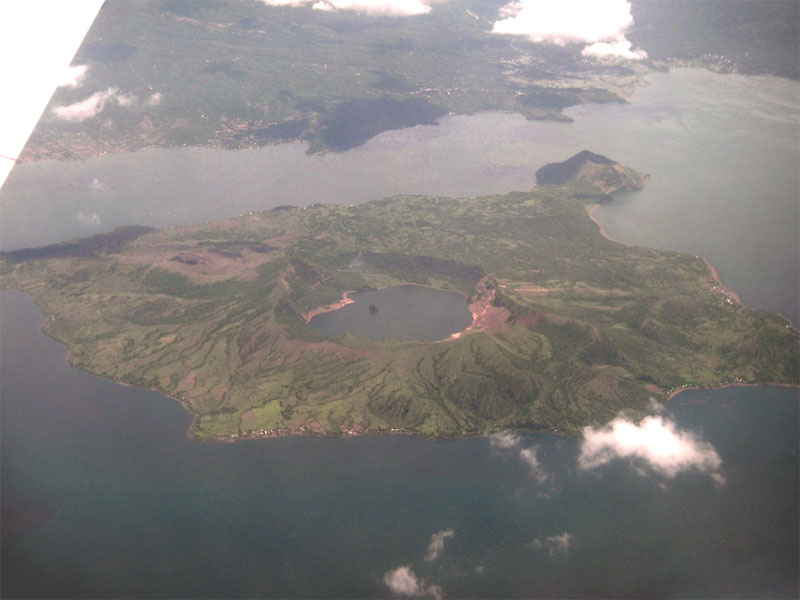
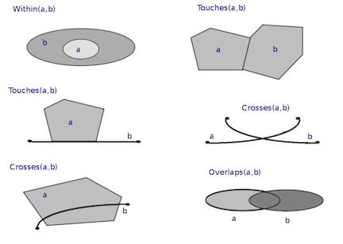

```{r message=FALSE, echo=FALSE}
suppressMessages(library(dplyr))
suppressMessages(library(sf))

options(width=100)
```

# Background

## Analysis of geospatial data in R {.smaller}

R has a rich package ecosystem for read/writing, manipulating, and analyzing geospatial data.

<br/>

Some core packages:

* `sp` - core classes for handling spatial data, additional utility functions.

* `rgdal` - R interface to `gdal` (Geospatial Data Abstraction Library) for reading and writing spatial data.

* `rgeos` - R interface to `geos` (Geometry Engine Open Source) library for querying and manipulating spatial data. Reading and writing WKT.

* `raster` - classes and tools for handling spatial raster data.

<br/>

See more - [Spatial task view](http://cran.r-project.org/web/views/Spatial.html)

## Analysis of geospatial data in R {.smaller}

R has a rich package ecosystem for read/writing, manipulating, and analyzing geospatial data.

<br/>

Some core packages:

* ~~`sp` - core classes for handling spatial data, additional utility functions.~~

* ~~`rgdal` - R interface to `gdal` (Geospatial Data Abstraction Library) for reading and writing spatial data.~~

* ~~`rgeos` - R interface to `geos` (Geometry Engine Open Source) library for querying and manipulating spatial data. Reading and writing WKT.~~

* `sf` - Combines the functionality of `sp`, `rgdal`, and `rgeos` into a single package based on tidy priciples.

* `raster` - classes and tools for handling spatial raster data.

<br/>

See more - [Spatial task view](http://cran.r-project.org/web/views/Spatial.html)


## Installing `sf`

The `sf` package is currently under active development and is evolving rapidly. For the time being I suggest installing the latest version from github instead of using CRAN.

```{r eval=FALSE}
library(devtools)
install_github('edzer/sfr')
library(sf)
```


## Taxonomy of geospatial objects (Simple Features) {.smaller}

```{r, echo=FALSE, results='hide'}
suppressMessages(library(rgeos, quietly=TRUE, warn.conflicts=FALSE))
suppressMessages(library(rgdal, quietly=TRUE, warn.conflicts=FALSE))
suppressMessages(library(sp, quietly=TRUE, warn.conflicts=FALSE))
suppressMessages(library(maptools, quietly=TRUE, warn.conflicts=FALSE))

poly_coords = function(sp)
{
  do.call(rbind,
          lapply(sp@polygons,
                 function(p)
                    do.call(rbind, lapply(p@Polygons,
                                          function(P)
                                            coordinates(P)
                                         )
                    )
          )
  )
}
```


```{r, echo=FALSE, out.width="1000px", out.height="500px"}
par(mar=c(1,1,2,1), mfrow=c(2,4))

## Point
sp = readWKT('POINT (30 10)')
plot(sp, axes=FALSE, main="Point", pch=16)
points(coordinates(sp), pch=16)
box()

## Linestring
sp = readWKT('LINESTRING (30 10, 10 30, 40 40)')
plot(sp, axes=FALSE, main="Linestring")
r=rapply(coordinates(sp), points, pch=16)
box()

## Polygon
sp = readWKT('POLYGON ((30 10, 40 40, 20 40, 10 20, 30 10))')
plot(sp, axes=FALSE, col="lightgrey", main="Polygon")
points(poly_coords(sp), pch=16)
box()

## Polygon with Hole
sp = readWKT('POLYGON ((35 10, 45 45, 15 40, 10 20, 35 10),
              (20 30, 35 35, 30 20, 20 30))')
plot(sp, axes=FALSE, col="lightgrey", main="Polygon w/ Hole(s)")
points(poly_coords(sp), pch=16)
box()


## MultiPoint
sp = readWKT('MULTIPOINT ((10 40), (40 30), (20 20), (30 10))')
plot(sp, axes=FALSE, pch=16, main="MultiPoint")
points(coordinates(sp), pch=16)
box()

## MultiLineString
sp = readWKT('MULTILINESTRING ((10 10, 20 20, 10 40),
                    (40 40, 30 30, 40 20, 30 10))')
plot(sp, axes=FALSE, main="MultiLinestring")
r=rapply(coordinates(sp), points, pch=16)
box()


## MultiPolygon
sp = readWKT('MULTIPOLYGON (((30 20, 45 40, 10 40, 30 20)),
                   ((15 5, 40 10, 10 20, 5 10, 15 5)))')
plot(sp, axes=FALSE, col="lightgrey", main="MultiPolygon")
points(poly_coords(sp), pch=16)
box()

## MultiPolygon with Hole(s)
sp = readWKT('MULTIPOLYGON (((40 40, 20 45, 45 30, 40 40)),
                   ((20 35, 10 30, 10 10, 30 5, 45 20, 20 35),
                    (30 20, 20 15, 20 25, 30 20)))')
plot(sp, axes=FALSE, col="lightgrey", main="MultiPolygon w/ Hole(s)")
points(poly_coords(sp), pch=16)
box()
```


## Geometry Collection {.smaller}

```{r, echo=FALSE, fig.align='center', out.width='750px'}
par(mar=c(1,1,1,1))

cols = c("#7fc97f","#386cb0","#beaed4","#fdc086")

pt   = readWKT('POINT (3 3)')
mpt  = readWKT('MULTIPOINT ((4 8), (1 8))')
mls  = readWKT('MULTILINESTRING ((4 6,7 10), (1 1,1 2,2 2))')
poly = readWKT('POLYGON ((6 6, 8 3, 8 8, 6 6))')
plot(0, 0, type='n', axes=FALSE, xlim=c(0,9),ylim=c(0,11),xlab="",ylab="", main="")
box()

plot(pt, add=TRUE, pch=16, col=cols[1], cex=1.5)

plot(mpt, add=TRUE, pch=16, col=cols[2], cex=1.5)

plot(mls, add=TRUE, col=cols[3], lwd=2)
r=rapply(coordinates(mls), points, pch=16, col=cols[3], cex=1.5)

plot(poly, add=TRUE, col=paste0(cols[4],"CC"),lwd=2,border=cols[4])
points(poly_coords(poly), pch=16, col=paste0(cols[4],"CC"),cex=1.5)
```

<div align="center">
Point, Multipoint, Multilinestring, Polygon
</div>


## Reading and writing geospatial data via `sp`

- `maptools`:
    * `readShapePoints` / `writeShapePoints` - Shapefile w/ points
    * `readShapeLines` / `writeShapeLines` - Shapefile w/ lines
    * `readShapePoly` / `writeShapePoly` - Shapefile w/ polygons
    * `readShapeSpatial` / `writeShapeSpatial` - Shapefile
- `rgdal`:
    * `readOGR` / `writeOGR` - Shapefile, GeoJSON, KML, ...
- `rgeos`:
    * `readWKT` / `writeWKT` - Well Known Text
- `sf`:
    * `st_read` / `st_write` - Shapefile, GeoJSON, KML, ...


# Geospatial stuff is hard

## Projections

```{r echo=FALSE, out.width="1000px", out.height="500px", fig.align="center"}
library(maptools)
data(wrld_simpl)
NAm = wrld_simpl[wrld_simpl$FIPS %in% c("CA","GL","MX","US"),]
NAm_google = spTransform(NAm, CRS("+init=epsg:3857"))

par(mar=c(3,2,2,1),mfrow=c(1,2))
plot(NAm, col="black", border=adjustcolor("black",alpha=0),
     main="Lat/Long (epsg:4326)", xlim=c(-180,-10), axes=TRUE)
box()

plot(NAm_google, col="black", border=adjustcolor("black",alpha=0),
     main="Google (epsg:3857)", axes=TRUE, xlim=c(-2e7,0), ylim=c(0,2e7))
box()
```

## Dateline

Want to fly from the Western most point in the US to the Eastern most point?


```{r echo=FALSE, fig.align="center", fig.height=4, fig.width=10}
par(mar=c(3,3,1,1))
ak = readOGR("data/ak/states.shp","states",FALSE)

for(i in 1:length(ak@polygons[[1]]@Polygons))
{
    p = ak@polygons[[1]]@Polygons[[i]]@coords
    p[p[,1] > 0,1] = -360 + p[p[,1] > 0,1]
    ak@polygons[[1]]@Polygons[[i]]@coords = p
}

plot(ak, col="black", xlim=c(-170,-190), ylim=c(51,53),axes=TRUE)
points(c(-360+179.776,-179.146), c(51.952,51.273),col='red')
abline(v=-180,col='blue',lty=2)
```

##

```{r echo=FALSE}
library(geosphere)
par(mar=c(0,0,0,0))
```

```{r fig.align="center", fig.width=10, fig.height=4.5}
inter = gcIntermediate(c(179.776,51.952), c(-179.146,51.273), n=50, addStartEnd=TRUE)

plot(wrld_simpl, col="black", ylim=c(15,90))
lines(inter,col='red',lwd=2,lty=3)
```

## Relationships



[Taal Volcano](https://www.google.com/maps/place/Taal+Volcano/@13.9732747,120.8720346,11z/data=!4m2!3m1!1s0x33bd738d30c66c4f:0x749396e27e5f3873)

## Distance

```{r echo=FALSE, fig.align="center"}
pt = readWKT("MULTIPOINT ((45 43), (15 70))")
ls = readWKT("LINESTRING (10 10, 10 90)")
po = readWKT("POLYGON ((30 50, 50 80, 70 50, 50 20, 30 50), (40 40, 60 40, 60 60, 40 60, 40 40))")

par(mar=c(0,0,0,0))
plot(0,0, type='n', axes=FALSE, xlab="", ylab="", xlim=c(0,90),ylim=c(0,90))


plot(pt, add=TRUE, pch=16, col=cols[1], cex=1.5)
text(48,50,"C",cex=3,col=cols[1])
text(18,77,"C",cex=3,col=cols[1])

plot(ls, add=TRUE, col=cols[3], lwd=2)
r=rapply(coordinates(ls), points, pch=16, col=cols[3], cex=1.5)
text(5,50,"B",cex=3,col=cols[3])

plot(po, add=TRUE, col=paste0(cols[4],"CC"),lwd=2,border=cols[4])
points(poly_coords(po), pch=16, col=paste0(cols[4],"CC"),cex=1.5)
text(35,70,"A",cex=3,col=paste0(cols[4],"CC"))
```

How do we define the distance between A and B, A and C, or B and C?


# Querying and Manipulating Spatial Data

## Example data {.smaller}

```{r}
nc  = st_read("data/gis/nc_counties/")
air = st_read("data/gis/airports/")
hwy = st_read("data/gis/us_interstates/")
```

## {.smaller}

```{r}
nc
```

## {.smaller}

```{r}
tbl_df(nc)
```


##

```{r echo=FALSE, fig.align="center", fig.height=4, fig.width=10}
par(mar=c(3,3,0.1,0.1), mfrow=c(1,3))
plot(nc,  axes=TRUE)
plot(air, axes=TRUE, pch=1, col="blue")
plot(hwy, axes=TRUE, col="red")
```


## {.smaller}
```{r echo=FALSE}
par(mar=c(0,0,0,0))
```

```{r}
nc = st_transform(nc, st_crs(hwy)$proj4string)
row.names(nc) = sub(" County","", as.character(nc$COUNTY))
air = st_transform(air, st_crs(hwy)$proj4string)
```

```{r fig.align="center"}
plot(nc, axes=TRUE)
plot(air, add=TRUE, pch=1, col="blue")
plot(hwy, add=TRUE, col="red")
```

## Distance to the closest airport from each county? {.smaller} 

```{r}
counties = which(row.names(nc) %in% c("Durham","Wake","Orange"))
d = st_distance(nc[counties,],air) 
str(d)
```

```{r}
nearest_airport = apply(d, 1, which.min) %>% unique()
air$AIRPT_NAME[nearest_airport] %>% as.character()
d[, nearest_airport, drop=FALSE]
```


## Distance to County centroid? {.smaller}

```{r}
(nc_cent = st_centroid(nc))

d = st_distance(nc_cent[counties],air) 

nearest_airport = apply(d, 1, which.min) %>% unique()
air$AIRPT_NAME[nearest_airport] %>% as.character()
d[, nearest_airport, drop=FALSE]
```


## Spatial predicates {.smaller}



<br/>

<div class="centered">
For more detail see the DE-9IM specification
</div>


## Which counties have airports? {.smaller}

```{r}
nc_air = st_intersects(nc, air) 
str(nc_air[20:30])

has_air = sapply(nc_air, function(x) length(x) > 0)
nc$COUNTY[has_air]
```

##

```{r fig.align="center"}
plot(nc, axes=TRUE)
plot(nc[has_air,], add=TRUE, col="lightblue")
plot(air[unlist(nc_air) %>% unique(),], add=TRUE, pch=16, col="blue")
```

## Adjacency matrix of counties {.smaller}

```{r}
durham = which(row.names(nc) == "Durham")
adj = st_touches(nc, sparse=FALSE)
str(adj)
nc$COUNTY[adj[durham,]] %>% as.character()
```

## {.smaller}

```{r fig.align="center"}
library(corrplot)
rownames(adj) = rownames(nc)
colnames(adj) = rownames(nc)
corrplot(adj[1:20,1:20],method="color",type="lower",tl.col="black",cl.pos = "n")
```

## Which counties have the most neighbors?

```{r fig.align="center"}
max(rowSums(adj))
most_neighbors = rowSums(adj)==max(rowSums(adj)) 
nc$COUNTY[most_neighbors] %>% as.character()
```


## 

```{r}
plot(nc, axes=TRUE)
plot(nc[most_neighbors,],add=TRUE,col="lightblue")
```

## Which counties have the least neighbors?

```{r fig.align="center"}
min(rowSums(adj))
least_neighbors = rowSums(adj)==min(rowSums(adj)) 
nc$COUNTY[least_neighbors] %>% as.character()
```


##

```{r}
plot(nc, axes=TRUE)
plot(nc[least_neighbors,],add=TRUE,col="lightblue")
```
